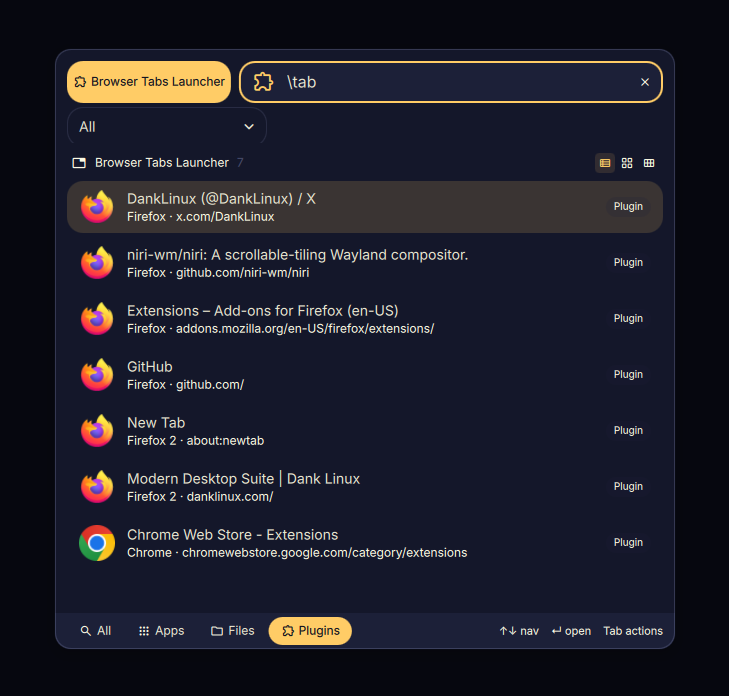

# Browser Tabs Launcher for DMS

A [DankMaterialShell](https://github.com/AvengeMedia/DankMaterialShell) launcher plugin that lists every open browser tab and lets you jump to one from the launcher. Tabs are sourced via [tabctl](https://github.com/slastra/tabctl).



## Features

- Lists open tabs across every browser tabctl is connected to
- Groups tabs by browser profile (`firefox`, `firefox2`, …) until you type a query
- Filters by title, URL, or profile as you type; multiple profiles also appear as launcher categories
- Activates the selected tab (focuses both tab and browser window)
- Per-browser icons (Brave, Brave Origin, Chrome, Chromium, Firefox, LibreWolf, Zen, Helium, Vivaldi, Opera) derived from the tabctl tab ID prefix
- Context menu: copy URL, close tab, refresh tab list
- Always-active mode (skip trigger keyword)
- Background refresh so tab changes are picked up without re-running `tabctl list` on every keystroke

## Installing tabctl

The plugin shells out to the `tabctl` CLI, which talks to a browser extension via a native-messaging host and D-Bus. All three pieces must be installed for tabs to show up.

1. **Install the `tabctl` CLI** (pick one):
   ```bash
   yay -S tabctl              # Arch Linux (AUR)
   paru -S tabctl             # alternative AUR helper
   ```
   Or from source:
   ```bash
   git clone https://github.com/slastra/tabctl.git
   cd tabctl
   make build
   ```
2. **Install the native-messaging host manifests**:
   ```bash
   tabctl install             # AUR / on PATH
   ./build/tabctl install     # from a source checkout
   ```
3. **Install the browser extension** in every browser you want indexed:
   - Firefox / Zen: <https://addons.mozilla.org/en-US/firefox/addon/tabctl1/>
   - Chrome / Chromium / Brave / Brave Origin / Helium: <https://chromewebstore.google.com/detail/tabctl/baomblllgemcgbignhpbipgiofmjdhpn>
4. **Restart each browser** and verify with:
   ```bash
   tabctl status   # should report OK for each connected browser
   tabctl list     # should print TSV of open tabs
   ```

If `tabctl status` reports no browsers, the extension is missing/disabled or the native-messaging manifest is missing — re-run `tabctl install`, restart the browser, and check `busctl --user list | grep -i tabctl`.

## Installing the plugin

Copy the plugin to your DMS plugins directory:

```bash
mkdir -p ~/.config/DankMaterialShell/plugins/tabsLauncher
cp TabsLauncher.qml TabsLauncherSettings.qml plugin.json \
  ~/.config/DankMaterialShell/plugins/tabsLauncher/
```

Restart DMS (`dms restart`) to discover the new plugin.

## Usage

Type `\tab` in the DMS launcher followed by your search query, or leave the query empty to see every open tab.

## Settings

Configure via DMS plugin settings:

| Setting | Description | Default |
|---|---|---|
| Enable Plugin | Toggle the plugin on/off | on |
| tabctl Path | Path to the `tabctl` executable | `tabctl` (PATH) |
| Always Active | Show results without a trigger prefix | off |
| Trigger | Prefix to list open tabs | `tab` |

## Requirements

- DankMaterialShell >= 1.4.0
- Quickshell
- [tabctl](https://github.com/slastra/tabctl) — see [Installing tabctl](#installing-tabctl) above. The plugin auto-discovers `tabctl` via the user's login shell (`$SHELL -lc`) so installs to `~/.local/bin` work without further configuration.

## License

MIT
